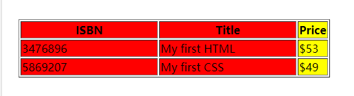

<custom-header/>

## 标签定义及使用说明

遇到的场景：ant design 的 table 组件通过这个标签下面的`<col>`来控制列的宽度。

[菜鸟教程介绍](https://www.runoob.com/tags/tag-colgroup.html)

`<colgroup>` 标签用于对表格中的列进行组合，以便对其进行格式化。

通过使用 `<colgroup>` 标签，可以向整个列应用样式，而不需要重复为每个单元格或每一行设置样式。

:::danger 注意
只能在 `<table>` 元素之内，在任何一个 `<caption>` 元素之后，在任何一个 `<thead>、<tbody>、<tfoot>、<tr>` 元素之前使用 `<colgroup>` 标签。
:::

## 测试代码

```html
<!DOCTYPE html>
<html>
  <head>
     
    <meta charset="utf-8" />
     
    <title>测试案例</title>
     
  </head>
  <body>
    <table border="1">
      <colgroup>
        <!-- span 规定列组应该横跨的列数。 -->
        <col span="2" style="background-color:red; width: 200px;" />
        <col style="background-color:yellow" />
      </colgroup>
      <tr>
        <th>ISBN</th>
        <th>Title</th>
        <th>Price</th>
      </tr>
      <tr>
        <td>3476896</td>
        <td>My first HTML</td>
        <td>$53</td>
      </tr>
      <tr>
        <td>5869207</td>
        <td>My first CSS</td>
        <td>$49</td>
      </tr>
    </table>
  </body>
</html>
```


