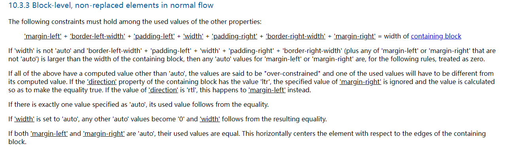

<custom-header/>


## 先回顾一下元素居右的其中方式

1. flex布局的justify-content: flex-end
2. 定位
3. float浮动
4. grid网格布局
5. margin-left: auto


前四种居右方式是我们开发中常用的，但是为什么`margin-left:auto`也可以实现呢。


## 测试一下

```html
<!DOCTYPE html>
<html lang="en">
  <head>
    <meta charset="UTF-8" />
    <title>Document</title>
    <style>
      .box {
        border: 1px solid orangered;
        height: 40px;
      }

      .child {
        width: 100px;
        height: 100%;
        background: gray;
        margin-left: auto;
      }
    </style>
  </head>
  <body>
    <div class="box">
      <div class="child"></div>
    </div>
  </body>
</html>

```


发现确实可以。


## 分析

1. 首先需要分析块级元素的宽度是如何计算

   `'margin-left' + 'border-left-width' + 'padding-left' + 'width' + 'padding-right' + 'border-right-width' + 'margin-right' = width of containing block`

   我们从上面的代码可知，除了`width`以外，其它属性都是值都是0。

   

2. 当且仅当其中某一个属性为auto（计算属性）时，这个auto值就是令等式成立的值。

   

3. 最后一条，当margin-left和margin-right都为auto时，两者就会一样，从而使元素居中（也就是我们平时经常通过`margin: 0 auto;`来实现元素的居中）


## 官网描述

[https://www.w3.org/TR/CSS2/visudet.html#blockwidth](https://www.w3.org/TR/CSS2/visudet.html#blockwidth)




参考文档：

- [https://blog.csdn.net/sinat_36521655/article/details/103394464](https://blog.csdn.net/sinat_36521655/article/details/103394464)