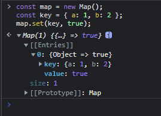
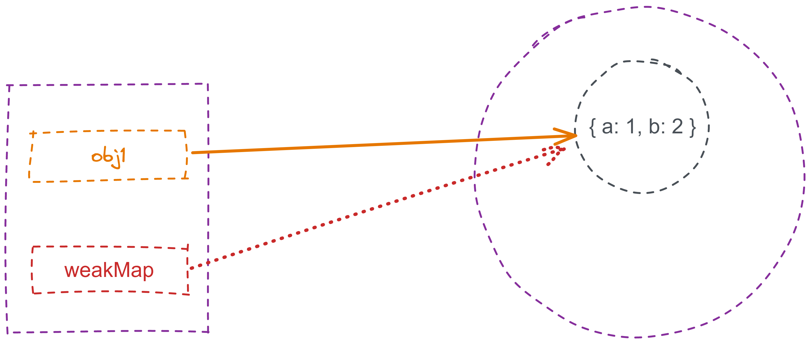

<custom-header />

## Map 结构

[MDN 介绍](https://developer.mozilla.org/zh-CN/docs/Web/JavaScript/Reference/Global_Objects/Map)

Map` 类似于对象，但是键名不限于 String 和 Symbol 两种类型，它的 key 可以是任意类型，结构优于传统的对象。

如下：map 使用 Object 作为 key

```js
const map = new Map();
const key = { a: 1, b: 2 };
map.set(key, true);
```



::: details Map 和 Object 的比较

|              | Map                                                                                                                                                                                                                                                                                                                                                  | Object                                                                                                                                                                                                                                                                                                                                                                                                                                                                                                                                                                                                                                                                                                                        |
| :----------- | :--------------------------------------------------------------------------------------------------------------------------------------------------------------------------------------------------------------------------------------------------------------------------------------------------------------------------------------------------- | :---------------------------------------------------------------------------------------------------------------------------------------------------------------------------------------------------------------------------------------------------------------------------------------------------------------------------------------------------------------------------------------------------------------------------------------------------------------------------------------------------------------------------------------------------------------------------------------------------------------------------------------------------------------------------------------------------------------------------- |
| 意外的键     | `Map` 默认情况不包含任何键。只包含显式插入的键。                                                                                                                                                                                                                                                                                                     | 一个 `Object` 有一个原型，原型链上的键名有可能和你自己在对象上的设置的键名产生冲突。                                                                                                                                                                                                                                                                                                                                                                                                                                                                                                                                                                                                                                          |
| 键的类型     | 一个 `Map` 的键可以是**任意值**，包括函数、对象或任意基本类型。                                                                                                                                                                                                                                                                                      | 一个 `Object` 的键必须是一个 [`String`](https://developer.mozilla.org/zh-CN/docs/Web/JavaScript/Reference/Global_Objects/String) 或是 [`Symbol`](https://developer.mozilla.org/zh-CN/docs/Web/JavaScript/Reference/Global_Objects/Symbol)。                                                                                                                                                                                                                                                                                                                                                                                                                                                                                   |
| 键的顺序     | `Map` 中的键是有序的。因此，当迭代的时候，一个 `Map` 对象以插入的顺序返回键值。                                                                                                                                                                                                                                                                      | 虽然 `Object` 的键目前是有序的，但并不总是这样，而且这个顺序是复杂的。因此，最好不要依赖属性的顺序。                                                                                                                                                                                                                                                                                                                                                                                                                                                                                                                                                                                                                          |
| Size         | `Map` 的键值对个数可以轻易地通过 [`size`](https://developer.mozilla.org/zh-CN/docs/Web/JavaScript/Reference/Global_Objects/Map/size) 属性获取。                                                                                                                                                                                                      | `Object` 的键值对个数只能手动计算。                                                                                                                                                                                                                                                                                                                                                                                                                                                                                                                                                                                                                                                                                           |
| 迭代         | `Map` 是 [可迭代的](https://developer.mozilla.org/zh-CN/docs/Web/JavaScript/Reference/Iteration_protocols) 的，所以可以直接被迭代。                                                                                                                                                                                                                  | `Object` 没有实现 [迭代协议](https://developer.mozilla.org/zh-CN/docs/Web/JavaScript/Reference/Iteration_protocols#the_iterable_protocol)，所以使用 JavaSctipt 的 [for...of](https://developer.mozilla.org/zh-CN/docs/Web/JavaScript/Reference/Statements/for...of) 表达式并不能直接迭代对象。**备注：**对象可以实现迭代协议，或者你可以使用 [`Object.keys`](https://developer.mozilla.org/zh-CN/docs/Web/JavaScript/Reference/Global_Objects/Object/keys) 或 [`Object.entries`](https://developer.mozilla.org/zh-CN/docs/Web/JavaScript/Reference/Global_Objects/Object/entries)。[for...in](https://developer.mozilla.org/zh-CN/docs/Web/JavaScript/Reference/Statements/for...in) 表达式允许你迭代一个对象的*可枚举*属性。 |
| 性能         | 在频繁增删键值对的场景下表现更好。                                                                                                                                                                                                                                                                                                                   | 在频繁添加和删除键值对的场景下未作出优化。                                                                                                                                                                                                                                                                                                                                                                                                                                                                                                                                                                                                                                                                                    |
| 序列化和解析 | 没有元素的序列化和解析的支持。（但是你可以使用携带 _replacer_ 参数的 [`JSON.stringify()`](https://developer.mozilla.org/zh-CN/docs/Web/JavaScript/Reference/Global_Objects/JSON/stringify) 创建一个自己的对 `Map` 的序列化和解析支持。参见 Stack Overflow 上的提问：[How do you JSON.stringify an ES6 Map?](https://stackoverflow.com/q/29085197/)） | 原生的由 [`Object`](https://developer.mozilla.org/zh-CN/docs/Web/JavaScript/Reference/Global_Objects/Object) 到 JSON 的序列化支持，使用 [`JSON.stringify()`](https://developer.mozilla.org/zh-CN/docs/Web/JavaScript/Reference/Global_Objects/JSON/stringify)。原生的由 JSON 到 [`Object`](https://developer.mozilla.org/zh-CN/docs/Web/JavaScript/Reference/Global_Objects/Object) 的解析支持，使用 [`JSON.parse()`](https://developer.mozilla.org/zh-CN/docs/Web/JavaScript/Reference/Global_Objects/JSON/parse)。                                                                                                                                                                                                          |

:::

### Map 的特点

1. Map 默认情况下不包含任何键，所有键都是自己添加进去的。不同于 Object 原型链上有一些默认的键。

2. Map 的键可以是**任意类型**数据，就连函数都可以。

3. Map 的键值对个数可以**轻易**通过`size`属性获取，Object 需要手动计算。

4. Map 在频繁增删键值对的场景下**性能**要比 Object 好。

### 什么时候用 Map

1. 要添加的键值名和 Object 上的默认键值名冲突，又不想改名时，**用 Map**
2. 需要 String 和 Symbol 以外的数据类型做键值时，**用 Map**
3. 键值对很多，有需要计算数量时，**用 Map**
4. 需要频繁增删键值对时，**用 Map**

## 什么是 WeakMap

[MDN 介绍](https://developer.mozilla.org/zh-CN/docs/Web/JavaScript/Reference/Global_Objects/WeakMap)

`WeakMap`是 ES6 中新增的一种集合类型，叫做“弱映射”。它和`Map`是兄弟关系，与`Map`的区别就在于这个**弱字**，API 还是`Map`的那套（只有`set` `get` `has` `delete`)

### WeakMap 的特点

只接受对象作为键名（`null` 除外），不接受其他类型的值作为键名；

### WeakMap 的键名引用的对象是弱引用

这是`WeakMap`结构的关键所在

#### 什么是强引用

```js
const obj1 = { a: 1, b: 2 };
const obj2 = { c: 3, d: 4 };

const arr = [
  [obj1, "这是obj1对象"],
  [obj2, "这是obj2对象"],
];
```

obj1 和 obj2 是两个对象，通过 arr 数组对这两个对象添加一些文字说明，这样就形成了 arr 对 obj1 和 obj2 的应用，这种应用就是`强引用`，当我们不需要这个对象时候，还需要手动的删除这个引用，解除 arr 对这两个对象的引用，否则垃圾回收机制不会释放这两个对象占用的内存。

```js
arr[0] = null;
arr[1] = null;
```

#### 什么是弱引用

创建一个弱引用对象

```js
const obj = new WeakMap();
```

#### 图解强引用和弱引用

强引用：

```js
const obj1 = { a: 1, b: 2 };
const map = new Map();

map.set(obj1, "引用了obj1对象");
```


从上图可以看出，obj1 这个对象被引用了两次，因此引用计数为 2。

弱引用：

```js
const obj1 = { a: 1, b: 2 };
const weakMap = new WeakMap();

weakMap.set(obj1, "引用了obj1对象");
```



从上图可以看出，obj1 被引用了 1 次，引用计数为 1.

::: tip 提示

如果强引用数据被删除时候，我们需要手动的解除引用，而弱引用可以直接等待垃圾回收机制自动清除。

当`obj1 = null`时会解除 obj1 对原数据的引用；

weakMap 实例对象对 obj1 所引用的对象是`弱引用关系`，该数据的引用计数就是 0，因此会被垃圾回收机制清除；

map 实例对象是对 obj1 所引用的对象是`强引用关系`，该数据的引用计数是 1， 因此不会被垃圾回收机制清除。

:::

### WeakMap 的应用场景

#### 1. DOM 节点元数据

因为 weakMap 不会影响垃圾回收，所以可以用来关联元数据


当上面代码执行后，登录按钮从 DOM 树中被删除了，但由于 Map 对节点对象是强引用关系，仍然保存着对按钮的引用，所以会引起内存泄漏


因此可以采用`WeakMap`当节点删除后，引用计数为 0，等待垃圾回收机制回收

#### 2. 部署私有属性

利用弱映射，将内部属性设置为实例的弱引用对象，当实例删除时，私有属性也会随之消失，因此不会内存泄漏


#### 3. 数据缓存

当我们需要在不修改原有对象的情况下储存某些属性等，而又不想管理这些数据时，可以使用`WeakMap`


## Map 和 WeakMap 的区别

1. `Map` 的键可以是任意类型，`WeakMap` 只接受对象作为键（null 除外），不接受其他类型的值作为键
2. `Map` 的键实际上是跟内存地址绑定的，只要内存地址不一样，就视为两个键； `WeakMap` 的键是弱引用，键所指向的对象可以被垃圾回收，此时键是无效的
3. `Map`可以被遍历， `WeakMap` 不能被遍历

---

- 原文地址：https://juejin.cn/post/6993101968545677319
