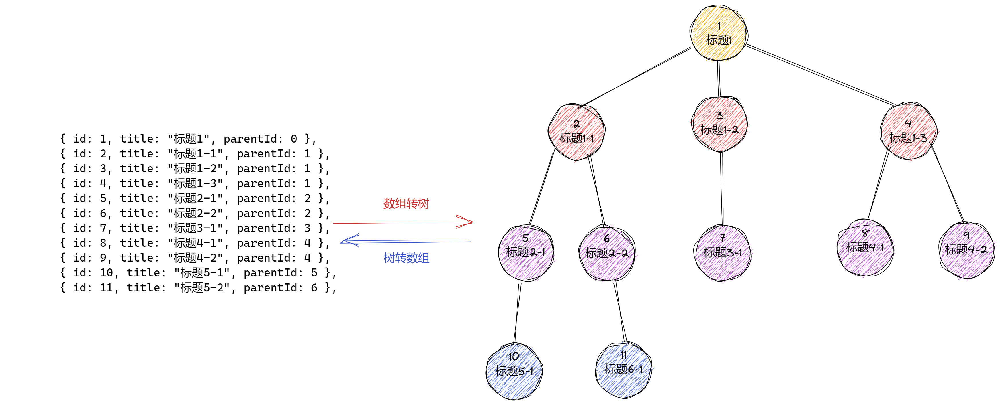

<custom-header />



### 数组转树

```javascript
const arr = [
  { id: 1, title: "标题1", parentId: 0 },
  { id: 2, title: "标题1-1", parentId: 1 },
  { id: 3, title: "标题1-2", parentId: 1 },
  { id: 4, title: "标题1-3", parentId: 1 },
  { id: 5, title: "标题2-1", parentId: 2 },
  { id: 6, title: "标题2-2", parentId: 2 },
  { id: 7, title: "标题3-1", parentId: 3 },
  { id: 8, title: "标题4-1", parentId: 4 },
  { id: 9, title: "标题4-2", parentId: 4 },
  { id: 10, title: "标题5-1", parentId: 5 },
  { id: 11, title: "标题5-2", parentId: 6 },
];

function convert(arr) {
  let root = null;

  const map = new Map(); // 用{}存储也是可以的

  arr.forEach((item) => {
    const { id, title, parentId } = item;

    /* 定义treeNode, 并加入到map中 */
    const treeNode = { id, title, children: [] };
    map.set(id, treeNode);

    /* 从map中找父级, 这就是优化点, 可以避免常规那种遍历查找父级的方式 */
    const parentNode = map.get(parentId);

    if (parentNode) {
      // 如果找到了父级, 那么把当前的节点插到父节点的children属性中
      parentNode.children.push(treeNode);
    }

    if (parentId === 0) root = treeNode; // parentId === 0默认为根节点
  });

  return root;
}

const tree = convert(arr);
console.log(tree);
```

### 树转数组

> 接着上面的树, 反向转换回来
>
> [广度优先遍历和深度优先遍历](https://www.1024nav.com/algorithm/dfs-vs-bfs)
>
> [Map 用法, 及和 Object 对比](https://developer.mozilla.org/zh-CN/docs/Web/JavaScript/Reference/Global_Objects/Map)

```javascript
/* 转换成的数组是排好序的, 根据上图可以看出来, 应该使用广度优先遍历 */
const treeToArray = (tree) => {
  if (!tree) return [];
  const arr = [];

  const map = new Map(); // 映射关系, 这里就不能用{}, 因为{}key只能是string和symbol类型,不能用object作为key

  const queue = []; // 使用辅助队列

  queue.unshift(tree); // 根节点入队

  /* 依次从队列中拿出一个节点, 并且把他自己的子节点继续入队 */
  while (queue.length > 0) {
    const curNode = queue.shift(); // 队头出队

    /* 如果当前节点存在的话, 说明队列还有节点没有遍历完 */
    if (curNode) {
      const { id, title, children } = curNode;

      /* 获取父节点, 从而可以得到父级id, 由于下面做了 子节点和父节点的映射关系 */
      const parentNode = map.get(curNode); // 获取父节点

      /* 根节点没有父级, 因此设置为0 */
      arr.push({ id, title, parentId: parentNode?.id || 0 }); // 创建数组元素并插入, 这时发现还要找到他的父级id, 可以事先搞一个映射关系

      children.forEach((child) => {
        queue.push(child); // 子节点继续入队

        /* 构建映射关系, 子节点: 父节点 */
        map.set(child, curNode);
      });
    }
  }

  return arr;
};

const tree = {
  id: 1,
  title: "标题1",
  children: [
    {
      id: 2,
      title: "标题1-1",
      children: [
        {
          id: 5,
          title: "标题2-1",
          children: [
            {
              id: 10,
              title: "标题5-1",
              children: [],
            },
          ],
        },
        {
          id: 6,
          title: "标题2-2",
          children: [
            {
              id: 11,
              title: "标题5-2",
              children: [],
            },
          ],
        },
      ],
    },
    {
      id: 3,
      title: "标题1-2",
      children: [
        {
          id: 7,
          title: "标题3-1",
          children: [],
        },
      ],
    },
    {
      id: 4,
      title: "标题1-3",
      children: [
        {
          id: 8,
          title: "标题4-1",
          children: [],
        },
        {
          id: 9,
          title: "标题4-2",
          children: [],
        },
      ],
    },
  ],
};

console.log(treeToArray(tree));
```
