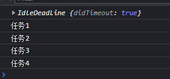

<custom-header/>

这个知识点是 React Fiber 发扬出来的，做一个大致的了解。

页面是一帧一帧的绘制出来，当每秒绘制的帧数（FPS）达到 60 时，页面是流畅的，小于这个值时，用户会感觉到卡顿。1s 60 帧，所以每一帧分到的时间是 1000/60 ≈ 16 ms。

## 浏览器每一帧都做了哪些事情呢？


从上图，我们可以分析，一帧内（16ms）做了什么事情？

::: tip 一帧内做了什么事情

1. 处理用户的交互
2. JS 的解析和执行
3. 帧的开始，处理页面尺寸的变化，滚动事件，媒体查询，动画事件。
4. 处理`requestAnimationFrame`和`IntersectionObserver`的回调函数。
5. 布局（重新计算样式，更新布局，处理`ResizeObserver`的回调函数）。
6. 绘制页面

:::

## requestIdleCallback

如果上面的 6 个步骤完成过后没超过 16ms，说明还有浏览器还有空闲时间，这时浏览器就会去执行`requestIdleCallback`的回调函数。

到目前为止，可以做一个初步的了解。

::: tip 提示

`requestAnimationFrame`是每一帧都会执行。

`requestIdleCallback`是浏览器有空闲时间才会执行。

（如果浏览器一直处于忙碌状态，那么`requestIdleCallback`的回调永远不会执行，可以通过设置`timeout`参数来保证运行。）

:::

### requestIdleCallback 基本使用

[MDN 介绍](https://developer.mozilla.org/zh-CN/docs/Web/API/Window/requestIdleCallback)

```js
const taskQueue = [
  () => {
    console.log("任务1");
  },
  () => {
    console.log("任务2");
  },
  () => {
    console.log("任务3");
  },
  () => {
    console.log("任务4");
  },
];

// 向浏览器申请空闲时间，用来执行wookloop，
// 如果没有空闲时间，此时会等待指定的 timeout 那么久再执行
requestIdleCallback(wookloop, { timeout: 100 });

function wookloop(deadline) {
  console.log(deadline);
  // 帧内还有空闲时间，或者超时了且任务队列中还有任务，就要执行任务了
  while (
    (deadline.timeRemaining() > 0 || deadline.didTimeout) &&
    taskQueue.length > 0
  ) {
    const currentWork = taskQueue.shift(); // 取出任务
    currentWork(); // 执行任务
  }

  //   如果任务队列中还有任务， 那么接着向浏览器申请下一帧的空闲时间
  if (taskQueue.length > 0) {
    requestIdleCallback(wookloop);
  }
}
```



::: tip 分析

分两种情况：

- 没有超时，说明浏览器不忙，有空闲时间用来执行 wookloop

- 超时了，浏览器一直处于忙碌状态，那么`requestIdleCallback`的回调会等待指定的 `timeout` 那么久再执行 （如果超时状态还选择继续执行的话，肯定会出现卡顿，因为会将一帧的时间拉长。）

:::

### 总结

一些低优先级的任务可使用 `requestIdleCallback` 等浏览器不忙的时候来执行，同时因为时间有限，它所执行的任务应该尽量是能够量化，细分的微任务（micro task）。（有时间但是不多，这时执行的回调函数功能很大，导致执行时间很长，就会将一帧拉的很长，导致卡顿。）

::: danger 注意

- 因为它发生在一帧的最后，此时页面布局已经完成，**所以不建议在 `requestIdleCallback` 里再操作 DOM**，这样会导致页面再次重绘。

- **DOM 操作建议在 rAF 中进行**。同时，操作 DOM 所需要的耗时是不确定的，因为会导致重新计算布局和视图的绘制，所以这类操作不具备可预测性。

- `Promise` 也不建议在这里面进行，因为 Promise 的回调属性 Event loop 中优先级较高的一种微任务，会在 `requestIdleCallback` 结束时立即执行，不管此时是否还有富余的时间，这样有很大可能会让一帧超过 16 ms。

:::

## requestAnimationFrame

在没有 `requestAnimationFrame` 方法的时候，执行动画，我们可能使用 `setTimeout` 或 `setInterval` 定时器来实现动画；但是用定时器会出现一种问题，它的回调函数执行的时间是不固定的，可能刚好就在末尾，或者直接就不执行了，经常会引起丢帧而导致页面卡顿。

::: tip 个人理解

- 刚好在末尾执行，那么导致这一帧时间拉的很长，导致卡顿；（某一帧执行时间长，那么 1s 渲染的帧数就小于 60 帧，因此就感觉卡顿）

- 不执行，例如在动画中定时器回调没有执行，导致这一帧没有变化（丢帧）；

:::

`setTimeout` 或 `setInterval` 的回调函数要先等同步代码执行完毕，异步队列中没有其他任务，才会轮到自己执行。并且，我们知道每一次重新渲染的最佳时间大约是 16.6 ms，如果定时器的时间间隔过短，就会造成过度渲染，增加开销；过长又会延迟渲染，使动画不流畅。

`requestAnimationFrame` 方法不同与 `setTimeout` 或 `setInterval`，它是由系统来决定回调函数的执行时机的，会请求浏览器在下一次重新渲染之前执行回调函数。无论设备的刷新率是多少，**`requestAnimationFrame` 的时间间隔都会紧跟屏幕刷新一次所需要的时间**；

例如某一设备的刷新率是 75 Hz，那这时的时间间隔就是 13.3 ms（1 秒 / 75 次）。需要注意的是这个方法虽然能够**保证回调函数在每一帧内只渲染一次**，但是**如果这一帧有太多任务执行，还是会造成卡顿的；因此它只能保证重新渲染的时间间隔最短是屏幕的刷新时间。**

### requestAnimationFrame 基本使用

[MDN 介绍](https://developer.mozilla.org/zh-CN/docs/Web/API/Window/requestAnimationFrame)

```html
<!DOCTYPE html>
<html lang="en">
  <head>
    <meta charset="UTF-8" />
    <meta http-equiv="X-UA-Compatible" content="IE=edge" />
    <meta name="viewport" content="width=device-width, initial-scale=1.0" />
    <title>Document</title>

    <style>
      .box {
        width: 100px;
        height: 100px;
        background: plum;
      }
    </style>
  </head>

  <body>
    <div class="box"></div>

    <script>
      let left = 0;
      let animationId = null;
      const box = document.querySelector(".box");

      function run() {
        left += 10;

        if (left > 1000) {
          cancelAnimationFrame(animationId);
        } else {
          box.style.transform = `translateX(${left}px)`;
          animationId = requestAnimationFrame(run);
        }
      }
      run();
    </script>
  </body>
</html>
```

---

[原文地址](https://juejin.cn/post/6844903848981577735)
