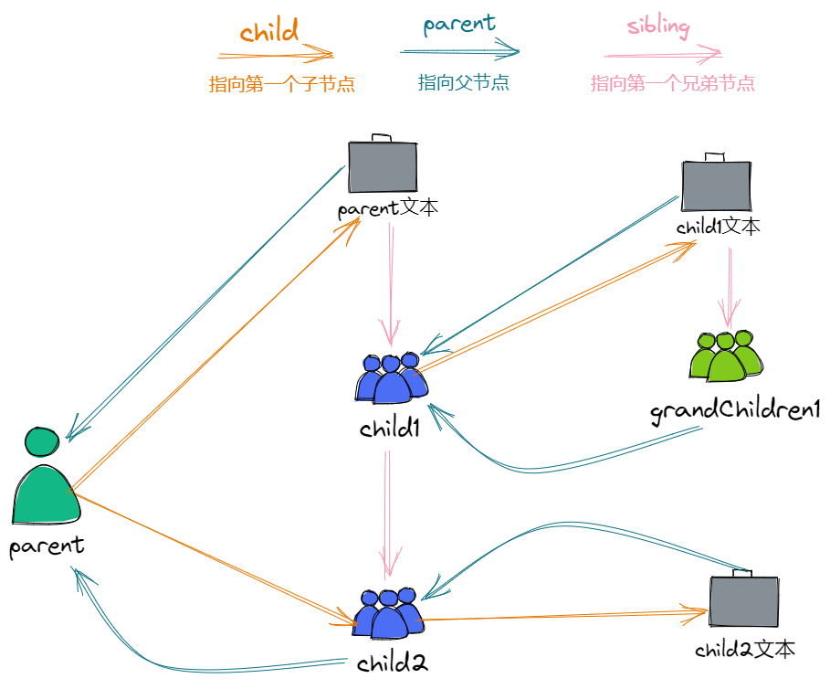
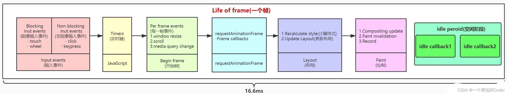
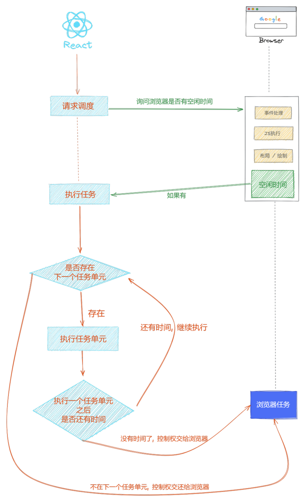

<custom-header/>

## Fiber 是一个执行单元

React 是把任务拆分成很多小任务块（Fiber），然后通过调度来控制他们的运行时机；

其实可以理解成一个执行单元，每次执行一个执行单元，就会检查这一帧还剩余多少时间，如果没有就将控制权交换给浏览器，如果有就接着运行执行单元。

**抛出了一个问题 JS 怎么知道运行的这一帧还剩余多少时间呢?** 后面会讲到

## Fiber 是一种数据结构

它是一个链表结构

```ts
function FiberNode(
  tag: WorkTag,
  pendingProps: mixed,
  key: null | string,
  mode: TypeOfMode
) {
  // Instance

  // tag 组件的类型 是函数组件还是类组件
  this.tag = tag;

  this.key = key;

  this.elementType = null;

  // 对于 函数组件，指函数本身，对于类组件，指class
  this.type = null;

  // Fiber对应的真实DOM节点
  this.stateNode = null;

  // 以下属性用于连接其他Fiber节点形成Fiber树。

  // 指向父fiber节点
  this.return = null;

  // 指向第一个子fiber节点
  this.child = null;

  // 指向第一个兄弟fiber节点
  this.sibling = null;
  this.index = 0;

  // 真实的DOM属性
  this.ref = null;

  // 新传入的 props
  this.pendingProps = pendingProps;

  // 之前的 props
  this.memoizedProps = null;

  // 更新队列，用于暂存 setState 的值
  this.updateQueue = null;

  // 之前的 state
  this.memoizedState = null;
  this.dependencies = null;

  this.mode = mode;

  // 保存本次更新会造成的DOM操作。比如删除，移动
  this.flags = NoFlags;
  this.nextEffect = null;

  this.firstEffect = null;
  this.lastEffect = null;

  this.lanes = NoLanes;
  this.childLanes = NoLanes;

  //用于链接新树和旧树；旧->新，新->旧
  this.alternate = null;
}
```

### 从示例看一下 Fiber 之间是如何连接的

```jsx
function App(props) {
  const content = (
    <div className="parent">
      parent文本
      <p className="child1">
        child1文本
        <span className="grandChildren1"></span>
      </p>
      <p className="child2">child2文本</p>
    </div>
  );
  console.log(content);
  return content;
}
```



## Fiber 解决了什么问题？

在 React16 之前采用的`Stack Reconciler`的更新机制，浏览器从执行栈的顶层开始递归，一层一层的执行，直到栈被清空了，这个更新才会停止。而我们直到递归是不能中断的，这就会导致一个问题，如果我们组件嵌套的很深的话，每一次触发更新，都需要把执行栈一次性执行完毕，中途不能执行其它的操作，这样就会存在页面卡顿的情况。

在 React16 之后实现了一套新的更新机制，让 React 的更新操作变得可控，从递归变成了遍历，也就是运用上面的链表结构，采用循环的形式进行更新。

## JS 怎么知道这一帧还剩余多少时间？

要理解这个问题，首先需要知道浏览器这一帧做了什么事情。



从上图最后一步可以看出，这一帧可能存在空闲时间，但是我们怎么知道有没有空闲时间呢。这里就谈到一个 api`requestIdleCallback`

MDN 官方解释：

[MDN---requestIdleCallback](https://developer.mozilla.org/zh-CN/docs/Web/API/Window/requestIdleCallback)

window.requestIdleCallback()方法插入一个函数，这个函数将在浏览器空闲时期被调用。这使开发者能够在主事件循环上执行后台和低优先级工作，而不会影响延迟关键事件，如动画和输入响应。函数一般会按先进先调用的顺序执行，然而，如果回调函数指定了执行超时时间 timeout，则有可能为了在超时前执行函数而打乱执行顺序。

### React 是如何利用这个空闲时间呢？

1. 询问浏览器是否存在空闲时间。
2. 如果有，就开始执行任务，判断是否有下一个执行任务，如果有就执行，没有就把控制权交还给浏览器。
3. 执行完再来判断是否还有时间，如果有接着执行下一个任务，没有就把控制权交还给浏览器。

具体流程如下图：


