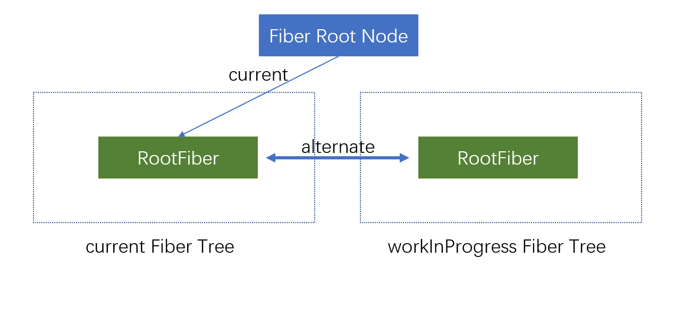

<custom-header/>
效果图:



#### 分析

如图可以看出来, 其实是两个表格拼凑在一起, 然后将合计的那一个表格的表头隐藏即可.

然后监听其中一个表格的滚动事件, 获取滚动距离, 最后给另外一个表格也设置这个滚动距离.

即可实现同步滚动.

#### 布局代码

```html
// 两个表格的dataSource不一样, columns是一致的
<div className="{`investment-base-table`}" ref="{tableContainerRef}">
  <Table dataSource={dataSource} columns={columns} scroll={{ x: "100%", y: "100%" }} /> <Table
  className="investment-base-table-total" dataSource={totalDataSource} columns={columns} scroll={{ x: "100%", y: "100%"
  }} />
</div>
;
```

#### 逻辑代码

```js
useEffect(() => {
  const tableContainer = tableContainerRef.current;
  const tbodys = tableContainer.querySelectorAll(".ant-table-body");

  const scrollFn = (e) => {
    tbodys[0].scrollLeft = e.target.scrollLeft;
  };

  tbodys[1] && tbodys[1].addEventListener("scroll", scrollFn);

  return () => {
    tbodys[1] && tbodys[1].removeEventListener("scroll", scrollFn);
  };
}, []);
```
