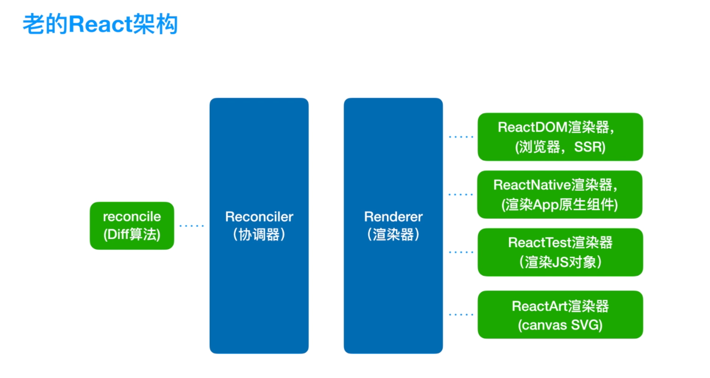
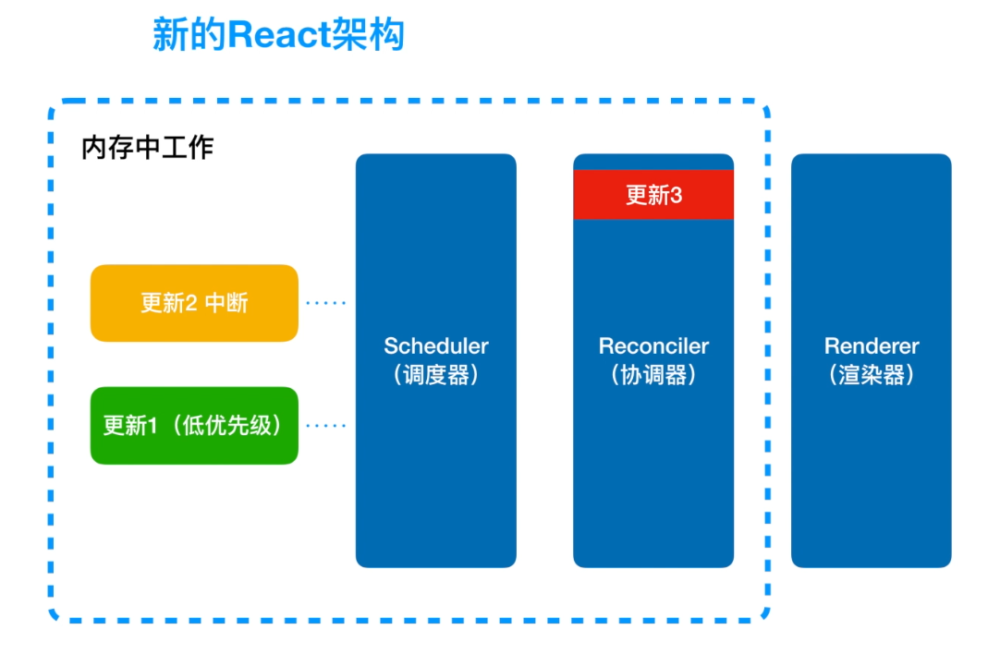
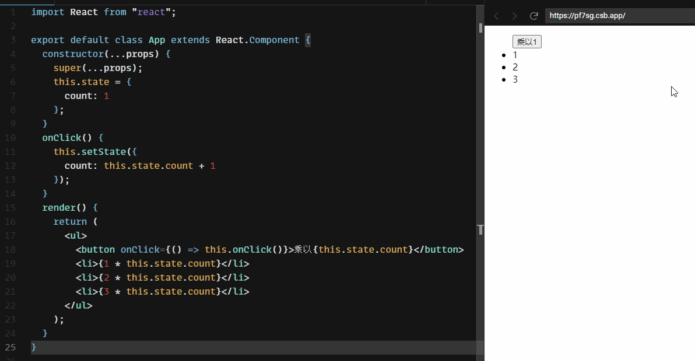
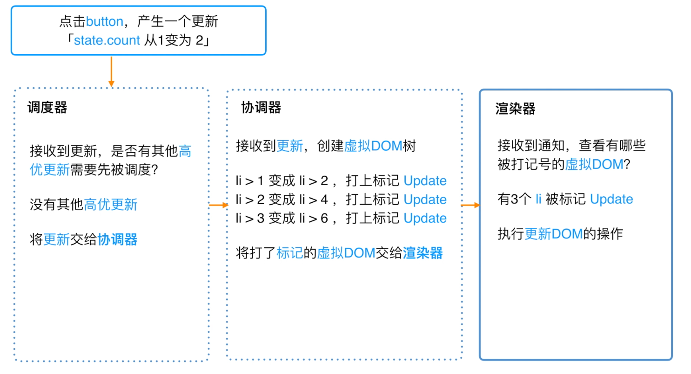

<custom-header/>

## 老版 React 架构

React 16 之前的架构

其实就分为两个部分：

- Reconciler 协调器
- Render 渲染器

`Reconciler协调器`负责本次更新有什么组件需要被渲染，diff 算法就发生在这个步骤中，在 diff 算法中会将上次更新的组件和本次更新的组件做一个对比，判定出本次需要更新的组件会交给`Render（渲染器）`渲染到视图中，不同的渲染器会将组件渲染到不同的宿主环境的视图中。

## 新版 React 架构

分为三大部分：

- Scheduler 调度器
- Reconciler 协调器
- Render 渲染器

在新的架构中，更新首先会被`调度器`处理，`调度器`会调度这些更新的优先级，更高优的更新会首先进入`协调器`，在`协调器`正在进行 diff 算法时，如果出现更高优先级的更新，那么正在协调的更新会被中断，由于`调度器`和`协调器`的工作都是在内存中工作，不会执行具体的视图操作，因此出现了中断发生，用户也不会看到更新不完全的视图。当某次更新完成了在`协调器`中的工作时，`协调器`会通知`渲染器`本次更新有哪些组件需要执行对应的视图操作，最后由`渲染器`来执行这些视图操作，后面就是重复执行整个流程。

## 解析新版 React 架构的示例

代码很简单，就是点击一个按钮让每个数字乘法运算，最终效果如下：

- 1 -> 2
- 2 -> 4
- 3 -> 6

### 分析

