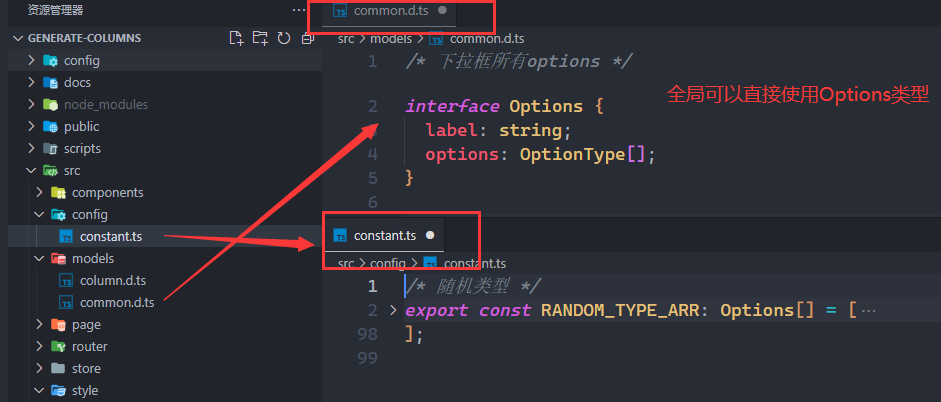
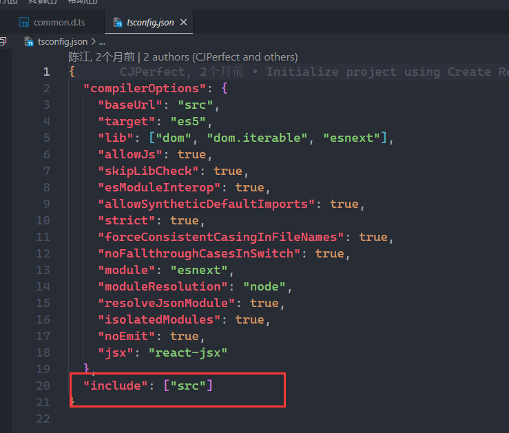

<custom-header/>

.d.ts 文件是 ts 用来声明变量，模块，type，interface 等等的，那在这种后缀的 ts 文件声明这些东西和在纯 ts 文件声明这些东西又什么区别呢？

在.d.ts 声明变量或者模块等东西之后，在其他地方可以不用 import 导入这些东西就可以直接用，而且有语法提示。



也不是创建了.d.ts 文件，里面声明的东西就能生效了，毕竟归根到底也是.ts 文件，需要预编译，所以需要在`tsconfig.json`文件里面的 include 数组里面添加这个文件



:::tip 提示
1..d.ts 文件顶级声明 declare 最好不要跟 export 同级使用，不然在其他 ts 引用这个.d.ts 的内容的时候，就需要手动 import 导入了

2.在.d.ts 文件里如果顶级声明不用 export 的话，declare 和直接写 type、interface 效果是一样的，在其他地方都可以直接引用

```ts
// 这个需要import才能使用
export type Person = { name: string; age: number };

// 这个两个全局可以直接使用（前提是include里面包含了这个文件)
type Person1 = { name: string; age: number };
declare type Person2 = { name: string; age: number };
```

:::
